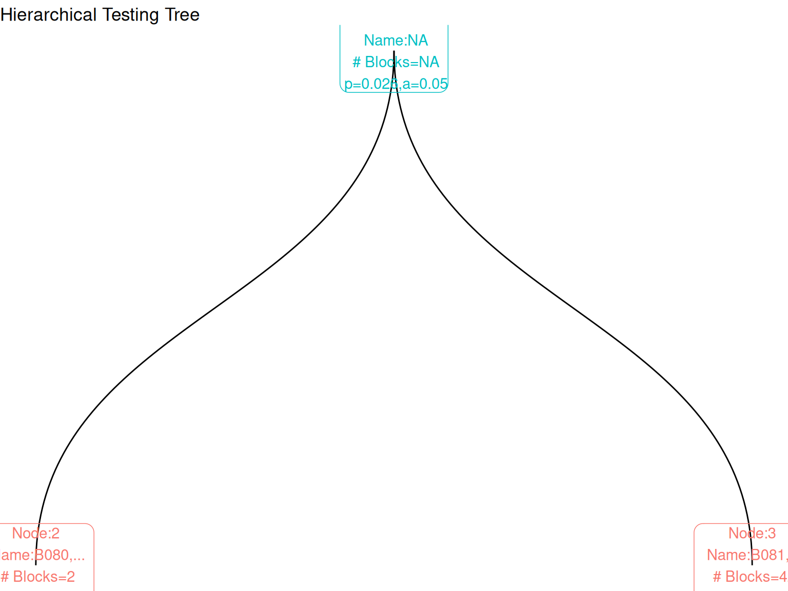

# Getting Started with manytestsr

## What is Hierarchical Testing?

The `manytestsr` package implements hierarchical testing procedures for
detecting treatment effects across multiple experimental blocks. Instead
of testing each block independently (which inflates Type I error) or
testing everything together (which reduces power), hierarchical testing:

1.  **Splits blocks** into groups based on similarity or pre-specified
    structure
2.  **Tests groups** at each level of the hierarchy  
3.  **Controls error rates** while maintaining power to detect
    heterogeneous effects

This is especially useful for: - Multi-site experiments with varying
treatment effects - A/B tests across different user segments  
- Clinical trials with multiple centers - Any setting with
clustered/blocked experimental units

## Quick Start

### Load Package and Data

``` r
library(manytestsr)
library(data.table)
library(dplyr)

# Load built-in example data
data(example_dat, package = "manytestsr")

# Prepare individual-level data
idat <- as.data.table(example_dat)

# Create block-level summary
bdat <- idat %>%
  group_by(blockF) %>%
  summarize(
    nb = n(),                    # Block size
    pb = mean(trt),             # Proportion treated
    hwt = (nb / nrow(idat)) * (pb * (1 - pb)),  # Harmonic mean weight
    .groups = "drop"
  ) %>%
  as.data.table()

print(paste("Data:", nrow(idat), "individuals in", nrow(bdat), "blocks"))
#> [1] "Data: 1268 individuals in 44 blocks"
```

### Run Hierarchical Testing

``` r
# Basic hierarchical testing
results <- find_blocks(
  idat = idat,                    # Individual-level data
  bdat = bdat,                    # Block-level data
  blockid = "blockF",             # Block identifier column
  splitfn = splitCluster,         # How to split blocks (k-means clustering)
  pfn = pOneway,                  # Statistical test to use (t-test)
  fmla = Y1 ~ trtF | blockF,     # Formula: outcome ~ treatment | block
  splitby = "hwt",               # Variable to guide splitting
  parallel = "no",               # Disable parallel processing for demo
  thealpha = 0.05                # Overall error rate
)

print(paste("Testing created", nrow(results$node_dat), "nodes in the tree"))
#> [1] "Testing created 1 nodes in the tree"
```

### Find Significant Effects

``` r
# Identify blocks with significant treatment effects
detections <- report_detections(results$bdat, fwer = TRUE, alpha = 0.05)

# Summary
cat("Results Summary:\n")
#> Results Summary:
cat("- Total blocks tested:", nrow(detections), "\n")
#> - Total blocks tested: 44
cat("- Blocks with significant effects:", sum(detections$hit, na.rm = TRUE), "\n")  
#> - Blocks with significant effects: 0
cat("- Detection rate:", round(mean(detections$hit, na.rm = TRUE) * 100, 1), "%\n")
#> - Detection rate: 0 %

# Show significant blocks if any found
if(sum(detections$hit, na.rm = TRUE) > 0) {
  sig_blocks <- detections[hit == TRUE, .(blockF, pfinalb)]
  cat("\nSignificant blocks:\n")
  print(sig_blocks)
}
```

## Key Components

### Splitting Functions

Choose how to divide blocks at each step:

``` r
# Cluster-based splitting (most common)
splitCluster      # Groups similar blocks using k-means

# Pre-specified hierarchical splitting  
splitSpecifiedFactor  # Follows predefined hierarchy (e.g., state > district > school)

# Leave-one-out splitting
splitLOO          # Focuses on largest/most powerful blocks first

# Equal-sum splitting
splitEqualApprox  # Balances total size/weight across groups
```

### Test Functions

Choose the statistical test:

``` r
pOneway       # T-tests (assumes normality)
pIndepDist    # Distance-based tests (robust, recommended)
pWilcox       # Wilcoxon rank-sum tests (ordinal outcomes)
```

### Error Control

Control Type I error rates:

``` r
# Fixed alpha (FWER control)
alphafn = NULL, thealpha = 0.05

# Sequential FDR control (more powerful)  
alphafn = alpha_investing, thealpha = 0.05, thew0 = 0.049
```

## Example: Different Approaches

### Approach 1: Robust Distance-Based Testing

``` r
results_robust <- find_blocks(
  idat = idat,
  bdat = bdat,
  blockid = "blockF",
  splitfn = splitCluster,
  pfn = pIndepDist,           # Distance-based test (robust)
  fmla = Y1 ~ trtF | blockF,
  splitby = "hwt",
  parallel = "no"
)

robust_detections <- report_detections(results_robust$bdat)
cat("Robust approach detections:", sum(robust_detections$hit, na.rm = TRUE), "\n")
#> Robust approach detections: 8
```

### Approach 2: Sequential FDR Control

``` r
results_fdr <- find_blocks(
  idat = idat,
  bdat = bdat, 
  blockid = "blockF",
  splitfn = splitCluster,
  pfn = pIndepDist,
  alphafn = alpha_investing,   # Sequential FDR control
  fmla = Y1 ~ trtF | blockF,
  splitby = "hwt",
  parallel = "no",
  thealpha = 0.05,
  thew0 = 0.049              # Starting "wealth"
)

fdr_detections <- report_detections(results_fdr$bdat, fwer = FALSE)
cat("FDR approach detections:", sum(fdr_detections$hit, na.rm = TRUE), "\n")
#> FDR approach detections: 44
```

## Visualizing Results

### Tree Structure

``` r
library(ggraph)
library(ggplot2)

# Create tree visualization
tree_data <- make_results_tree(results$bdat, block_id = "blockF")
tree_plot <- make_results_ggraph(tree_data$graph)

# Display the tree
tree_plot + 
  labs(title = "Hierarchical Testing Tree") +
  theme_void()
```



### Results Summary

``` r
# Create summary table
summary_table <- tree_data$test_summary
if(!is.null(summary_table) && is.data.frame(summary_table) && nrow(summary_table) > 0) {
  cat("Test Summary:\n")
  print(summary_table)
} else {
  cat("Tree structure (nodes by depth):\n")
  if(!is.null(tree_data$nodes) && is.data.frame(tree_data$nodes)) {
    print(tree_data$nodes[, .N, by = depth])
  } else {
    cat("Tree data structure available but not displayed in simple format.\n")
  }
}
#> Tree structure (nodes by depth):
#>    depth     N
#>    <int> <int>
#> 1:     1     1
#> 2:     2     2
```

## Best Practices

### 1. Data Preparation

- Ensure treatment assignment is balanced within blocks
- Include relevant block-level covariates for splitting
- Calculate appropriate power weights (harmonic mean weights work well)

### 2. Method Selection

- **Start with**: `splitCluster` + `pIndepDist` + `alpha_investing`
- **For hierarchical data**: Use `splitSpecifiedFactor`
- **For robustness**: Always consider `pIndepDist`
- **For power**: Use sequential procedures (`alpha_investing`,
  `alpha_saffron`)

### 3. Interpretation

- Focus on blocks identified as significant
- Consider effect sizes, not just p-values
- Validate findings with additional data if possible

## Advanced Methodologies

The `manytestsr` package also includes state-of-the-art methodologies
from leading researchers:

### Goeman’s Closed Testing

``` r
# Enhanced FWER control with improved power
results_goeman <- find_blocks(
  idat = idat, bdat = bdat,
  blockid = "blockF", splitfn = splitCluster, pfn = pIndepDist,
  fmla = Y1 ~ trtF | blockF, splitby = "hwt", parallel = "no",
  use_closed_testing = TRUE,                    # Enable Goeman's method
  closed_testing_method = "simes",              # Recommended approach
  thealpha = 0.05
)
```

### Meinshausen’s Hierarchical Testing

``` r
# Hierarchical variable importance testing with sequential rejection
results_meinshausen <- find_blocks(
  idat = idat, bdat = bdat,
  blockid = "blockF", splitfn = splitCluster, pfn = pIndepDist,
  fmla = Y2 ~ trtF | blockF, splitby = "hwt", parallel = "no",
  use_meinshausen = TRUE,                       # Enable Meinshausen's method
  meinshausen_method = "simes",                 # P-value combination
  meinshausen_sequential = TRUE,                # Sequential rejection enhancement
  thealpha = 0.05
)
```

### E-values for Sequential Testing

``` r
# Always-valid inference for sequential data collection
results_evalues <- find_blocks(
  idat = idat, bdat = bdat,
  blockid = "blockF", splitfn = splitCluster, pfn = pOneway,
  fmla = Y1 ~ trtF | blockF, splitby = "hwt", parallel = "no",
  use_evalues = TRUE,                           # Enable e-value methodology
  evalue_wealth_rule = "kelly",                 # Wealth accumulation rule
  thealpha = 0.05
)
```

### Next Steps

For comprehensive coverage of advanced methodologies, see the
specialized vignettes: - **Advanced Methodologies**: Goeman,
Meinshausen, Ramdas, and Rosenbaum approaches - **Hierarchical Testing
Workflow**: Complete analysis pipelines - **Design Sensitivity
Analysis**: Robustness to unobserved confounding

The hierarchical testing framework provides a principled way to navigate
the multiple testing problem while maintaining power to detect
heterogeneous treatment effects across experimental blocks.
