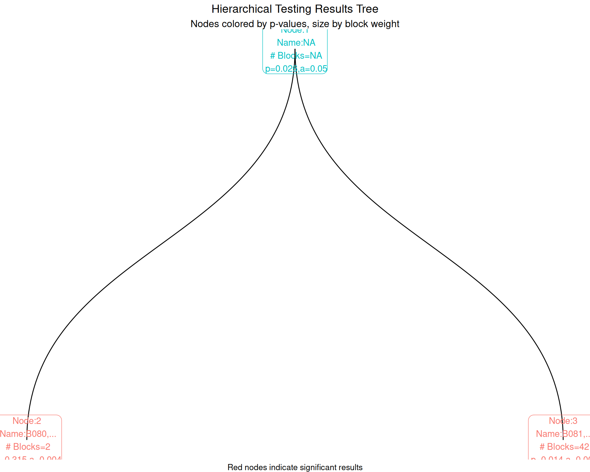
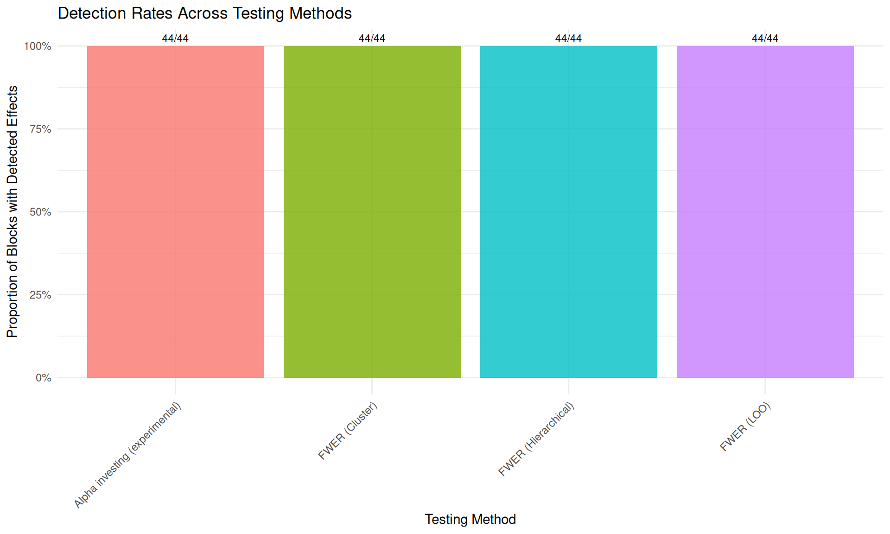
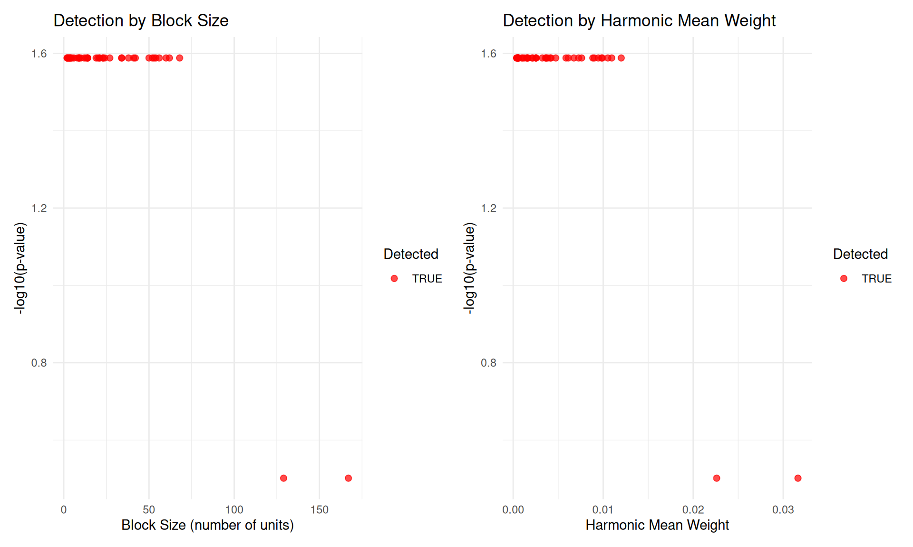

# Hierarchical Testing with manytestsr

## Introduction

The `manytestsr` package implements hierarchical testing procedures for
detecting treatment effects across multiple experimental blocks while
controlling error rates. This approach is particularly useful when you
have:

- Multiple experimental units organized in blocks
- Heterogeneous treatment effects across blocks
- Need to identify which specific blocks show effects
- Want to control family-wise error rate (FWER) or false discovery rate
  (FDR)

This vignette walks through the complete workflow from data preparation
to results interpretation.

## Loading the Package and Data

``` r

library(manytestsr)
library(data.table)
library(dplyr)
library(ggplot2)
library(ggraph)

# Load example data
data(example_dat, package = "manytestsr")
head(example_dat)
#>       id  year   trt    Y1    Y2   trtF place_year_block  place blockF
#>    <int> <int> <int> <num> <num> <fctr>           <char> <char> <fctr>
#> 1:     1     1     0     0     0      0         A.1.B082      A   B082
#> 2:     2     3     0     0    12      0         B.3.B094      B   B094
#> 3:     3     1     0     0     0      0         C.1.B097      C   B097
#> 4:     4     1     0     6     0      0         C.1.B097      C   B097
#> 5:     5     1     0     7    11      0         B.1.B089      B   B089
#> 6:     6     1     1     0     0      1         A.1.B080      A   B080
```

The example dataset contains:

- `id`: Individual unit identifier
- `blockF`: Block (cluster) factor
- `trtF`: Treatment assignment factor (0 = control, 1 = treatment)
- `Y1`, `Y2`: Outcome variables
- `place`: Location identifier
- `year`: Time identifier
- `place_year_block`: Hierarchical grouping variable

## Data Preparation

The hierarchical testing approach requires both individual-level data
(`idat`) and block-level summaries (`bdat`):

``` r

# Individual-level data is already in the right format
idat <- as.data.table(example_dat)
print(paste("Number of individuals:", nrow(idat)))
#> [1] "Number of individuals: 1268"
print(paste("Number of blocks:", length(unique(idat$blockF))))
#> [1] "Number of blocks: 44"

# Create block-level dataset with key variables
bdat <- idat %>%
  group_by(blockF) %>%
  summarize(
    # Sample size
    nb = n(),
    # Proportion treated
    pb = mean(trt),
    # Harmonic mean weight (for testing power)
    hwt = (nb / nrow(idat)) * (pb * (1 - pb)),
    # Block characteristics
    place = unique(place),
    year = unique(year),
    place_year_block = factor(unique(place_year_block)),
    .groups = "drop"
  ) %>%
  as.data.table()

head(bdat)
#>    blockF    nb        pb         hwt  place  year place_year_block
#>    <fctr> <int>     <num>       <num> <char> <int>           <fctr>
#> 1:   B080   129 0.6666667 0.022607781      A     1         A.1.B080
#> 2:   B081    68 0.6617647 0.012003618      A     1         A.1.B081
#> 3:   B082    56 0.6607143 0.009900293      A     1         A.1.B082
#> 4:   B083     8 0.6250000 0.001478707      A     1         A.1.B083
#> 5:   B084     9 0.7777778 0.001226779      A     2         A.2.B084
#> 6:   B085    53 0.6226415 0.009820844      A     3         A.3.B085
```

Key block-level variables:

- **`hwt`** (harmonic mean weight): Measures testing power for each
  block
- **`nb`** (block size): Number of units in each block
- **`pb`** (proportion treated): Treatment assignment rate
- **`place_year_block`**: Hierarchical factor for pre-specified splits

## Basic Hierarchical Testing

### Using Cluster-Based Splitting

The most common approach uses clustering to split blocks based on a
continuous variable:

``` r

# Run hierarchical testing with cluster-based splitting
results_cluster <- find_blocks(
  idat = idat,
  bdat = bdat,
  blockid = "blockF",
  splitfn = splitCluster, # Split using k-means clustering
  pfn = pOneway, # Use t-tests
  fmla = Y1 ~ trtF | blockF,
  splitby = "hwt", # Split based on harmonic mean weights
  parallel = "no", # Disable parallel processing for demo
  trace = TRUE, # Show split progression
  thealpha = 0.05
)

# Examine the structure
str(results_cluster, max.level = 1)
#> List of 2
#>  $ bdat    :Classes 'data.table' and 'data.frame':   44 obs. of  17 variables:
#>   ..- attr(*, ".internal.selfref")=<pointer: 0x5580d510fb20> 
#>   ..- attr(*, "sorted")= chr "testable"
#>  $ node_dat:Classes 'data.table' and 'data.frame':   1 obs. of  10 variables:
#>   ..- attr(*, ".internal.selfref")=<pointer: 0x5580d510fb20>
```

### Results Overview

``` r

# Block-level results
cat("Block-level results structure:\n")
#> Block-level results structure:
cat("Number of blocks:", nrow(results_cluster$bdat), "\n")
#> Number of blocks: 44
cat("Variables:", names(results_cluster$bdat), "\n\n")
#> Variables: blockF nb pb hwt place year place_year_block p1 pfinalb group_id node_id g1 alpha1 testable nodenum_current nodenum_prev blocksbygroup

# Node-level results
cat("Node-level results structure:\n")
#> Node-level results structure:
cat("Number of nodes:", nrow(results_cluster$node_dat), "\n")
#> Number of nodes: 1
cat("Depth levels:", sort(unique(results_cluster$node_dat$depth)), "\n")
#> Depth levels: 1
```

## Alternative Splitting Strategies

### Pre-specified Hierarchical Splitting

When you have natural hierarchical structure, use factor-based
splitting:

``` r

# Use pre-specified hierarchical splits
results_hierarchical <- find_blocks(
  idat = idat,
  bdat = bdat,
  blockid = "blockF",
  splitfn = splitSpecifiedFactor,
  pfn = pIndepDist, # Use distance-based test
  fmla = Y2 ~ trtF | blockF,
  splitby = "place_year_block",
  parallel = "no",
  trace = TRUE,
  thealpha = 0.05
)

print(paste(
  "Hierarchical approach found",
  nrow(results_hierarchical$node_dat), "nodes"
))
#> [1] "Hierarchical approach found 5 nodes"
```

### Leave-One-Out Splitting

Focus testing on largest blocks first:

``` r

# Leave-one-out approach
results_loo <- find_blocks(
  idat = idat,
  bdat = bdat,
  blockid = "blockF",
  splitfn = splitLOO,
  pfn = pOneway,
  fmla = Y1 ~ trtF | blockF,
  splitby = "hwt", # Focus on blocks with highest power
  parallel = "no",
  thealpha = 0.05
)

print(paste(
  "LOO approach found",
  nrow(results_loo$node_dat), "nodes"
))
#> [1] "LOO approach found 1 nodes"
```

## Sequential Alpha Procedures (Experimental)

The package wraps sequential alpha procedures from the `onlineFDR`
package (`alpha_investing`, `alpha_saffron`, `alpha_addis`). These
procedures treat the tree’s p-values as a flat stream, and their
guarantees are proven for that stream setting, not for gated
tree-structured testing. We do not recommend them for applied work and
plan to deprecate them (see the package README). We run one here only to
show how the per-node alpha levels adapt as testing proceeds.

``` r

# Alpha investing: experimental in the tree setting (see caution above)
results_fdr <- find_blocks(
  idat = idat,
  bdat = bdat,
  blockid = "blockF",
  splitfn = splitCluster,
  pfn = pIndepDist,
  alphafn = alpha_investing, # Sequential alpha adjustment
  fmla = Y1 ~ trtF | blockF,
  splitby = "hwt",
  parallel = "no",
  thealpha = 0.05,
  thew0 = 0.049 # Starting wealth
)

# Compare alpha levels across approaches
alpha_comparison <- data.frame(
  Node = 1:min(nrow(results_cluster$node_dat), nrow(results_fdr$node_dat)),
  Fixed_Alpha = results_cluster$node_dat$a[1:min(
    nrow(results_cluster$node_dat),
    nrow(results_fdr$node_dat)
  )],
  Adaptive_Alpha = results_fdr$node_dat$a[1:min(
    nrow(results_cluster$node_dat),
    nrow(results_fdr$node_dat)
  )]
)

print("Alpha level comparison:")
#> [1] "Alpha level comparison:"
head(alpha_comparison)
#>   Node Fixed_Alpha Adaptive_Alpha
#> 1    1        0.05           0.05
```

## Detecting Significant Effects

### Using FWER Control

``` r

# Detect significant blocks using FWER control
detections_fwer <- report_detections(
  results_cluster$bdat,
  fwer = TRUE,
  alpha = 0.05,
  blockid = "blockF"
)

# Summary of detections (hit is never NA, so plain sums work)
cat("FWER Results:\n")
#> FWER Results:
cat("Total blocks:", nrow(detections_fwer), "\n")
#> Total blocks: 44
cat("Detected blocks:", sum(detections_fwer$hit), "\n")
#> Detected blocks: 44
cat(
  "Detection rate:",
  round(mean(detections_fwer$hit) * 100, 1), "%\n\n"
)
#> Detection rate: 100 %

# Detections by type: "single" = the block's own test rejected;
# "group" = the block's parent group was rejected but the effect could
# not be attributed to specific blocks within it
cat("Detections by type:\n")
#> Detections by type:
print(table(detections_fwer$hit_type))
#> 
#> group 
#>    44

# Show detected blocks
if (any(detections_fwer$hit)) {
  significant_blocks <- detections_fwer[
    hit == TRUE,
    .(blockF, hit_type, pfinalb, group_p, fin_nodenum)
  ]
  print("Detected blocks:")
  print(significant_blocks)
}
#> [1] "Detected blocks:"
#>     blockF hit_type    pfinalb    group_p fin_nodenum
#>     <fctr>   <char>      <num>      <num>       <int>
#>  1:   B080    group 0.31532033 0.02580835           2
#>  2:   B081    group 0.02580835 0.02580835           3
#>  3:   B082    group 0.02580835 0.02580835           3
#>  4:   B083    group 0.02580835 0.02580835           3
#>  5:   B084    group 0.02580835 0.02580835           3
#>  6:   B085    group 0.02580835 0.02580835           3
#>  7:   B086    group 0.31532033 0.02580835           2
#>  8:   B087    group 0.02580835 0.02580835           3
#>  9:   B088    group 0.02580835 0.02580835           3
#> 10:   B089    group 0.02580835 0.02580835           3
#> 11:   B090    group 0.02580835 0.02580835           3
#> 12:   B091    group 0.02580835 0.02580835           3
#> 13:   B092    group 0.02580835 0.02580835           3
#> 14:   B093    group 0.02580835 0.02580835           3
#> 15:   B094    group 0.02580835 0.02580835           3
#> 16:   B095    group 0.02580835 0.02580835           3
#> 17:   B096    group 0.02580835 0.02580835           3
#> 18:   B097    group 0.02580835 0.02580835           3
#> 19:   B098    group 0.02580835 0.02580835           3
#> 20:   B099    group 0.02580835 0.02580835           3
#> 21:   B100    group 0.02580835 0.02580835           3
#> 22:   B101    group 0.02580835 0.02580835           3
#> 23:   B102    group 0.02580835 0.02580835           3
#> 24:   B103    group 0.02580835 0.02580835           3
#> 25:   B104    group 0.02580835 0.02580835           3
#> 26:   B105    group 0.02580835 0.02580835           3
#> 27:   B106    group 0.02580835 0.02580835           3
#> 28:   B107    group 0.02580835 0.02580835           3
#> 29:   B108    group 0.02580835 0.02580835           3
#> 30:   B109    group 0.02580835 0.02580835           3
#> 31:   B110    group 0.02580835 0.02580835           3
#> 32:   B111    group 0.02580835 0.02580835           3
#> 33:   B112    group 0.02580835 0.02580835           3
#> 34:   B113    group 0.02580835 0.02580835           3
#> 35:   B114    group 0.02580835 0.02580835           3
#> 36:   B115    group 0.02580835 0.02580835           3
#> 37:   B116    group 0.02580835 0.02580835           3
#> 38:   B117    group 0.02580835 0.02580835           3
#> 39:   B118    group 0.02580835 0.02580835           3
#> 40:   B119    group 0.02580835 0.02580835           3
#> 41:   B120    group 0.02580835 0.02580835           3
#> 42:   B121    group 0.02580835 0.02580835           3
#> 43:   B122    group 0.02580835 0.02580835           3
#> 44:   B123    group 0.02580835 0.02580835           3
#>     blockF hit_type    pfinalb    group_p fin_nodenum
#>     <fctr>   <char>      <num>      <num>       <int>
```

The `hit_type` column keeps the two kinds of findings separate. A
`"single"` hit localizes an effect to that block: its own test rejected.
A `"group"` hit records a coarser finding: the block’s parent group was
rejected while no test inside the group rejected, so the effect sits
somewhere in the group without being attributed to particular blocks.
For group hits, `group_p` carries the rejecting parent’s p-value; the
block’s own `pfinalb` stays above alpha, which is exactly why the
finding remains at the group level. Blocks under a rejected parent do
not inherit coverage when a sibling’s own detection already explains the
parent’s rejection; those blocks show `hit_type == "none"`.

### Detections from the Experimental Sequential Run

The alpha-investing run from the previous section can be summarized the
same way. The caution given there applies to these counts too: no proven
error-rate guarantee attaches to them in the tree setting.

``` r

detections_fdr <- report_detections(
  results_fdr$bdat,
  fwer = FALSE, # Use each block's final-depth p rather than the path maximum
  alpha = 0.05
)

cat("Alpha-investing (experimental) results:\n")
#> Alpha-investing (experimental) results:
cat("Detected blocks:", sum(detections_fdr$hit), "\n")
#> Detected blocks: 44
cat(
  "Detection rate:",
  round(mean(detections_fdr$hit) * 100, 1), "%\n"
)
#> Detection rate: 100 %
```

## Visualizing Results

### Tree Structure Visualization

``` r

# Create tree structure for visualization
tree_results <- make_results_tree(
  results_cluster,
  block_id = "blockF",
  node_label = "hwt"
)

# Create the graph visualization
tree_plot <- make_results_ggraph(tree_results$graph, remove_na_p = TRUE)

# Customize the plot
tree_plot_styled <- tree_plot +
  labs(
    title = "Hierarchical Testing Results Tree",
    subtitle = "Nodes colored by p-values, size by block weight",
    caption = "Red nodes indicate significant results"
  ) +
  theme_void() +
  theme(
    plot.title = element_text(size = 14, hjust = 0.5),
    plot.subtitle = element_text(size = 12, hjust = 0.5),
    plot.caption = element_text(size = 10, hjust = 0.5)
  )

print(tree_plot_styled)
```



### Detection Summary Plot

``` r

# Compare detection rates across methods
detection_summary <- data.frame(
  Method = c(
    "FWER (Cluster)", "Alpha investing (experimental)",
    "FWER (Hierarchical)", "FWER (LOO)"
  ),
  Detections = c(
    sum(detections_fwer$hit),
    sum(detections_fdr$hit),
    sum(report_detections(results_hierarchical$bdat, fwer = TRUE)$hit),
    sum(report_detections(results_loo$bdat, fwer = TRUE)$hit)
  ),
  Total_Blocks = c(
    nrow(detections_fwer),
    nrow(detections_fdr),
    nrow(results_hierarchical$bdat),
    nrow(results_loo$bdat)
  )
)

detection_summary$Detection_Rate <- detection_summary$Detections / detection_summary$Total_Blocks

# Create comparison plot
ggplot(detection_summary, aes(x = Method, y = Detection_Rate, fill = Method)) +
  geom_col(alpha = 0.8) +
  geom_text(aes(label = paste0(Detections, "/", Total_Blocks)),
    vjust = -0.5, size = 3
  ) +
  labs(
    title = "Detection Rates Across Testing Methods",
    y = "Proportion of Blocks with Detected Effects",
    x = "Testing Method"
  ) +
  scale_y_continuous(labels = scales::percent_format()) +
  theme_minimal() +
  theme(
    axis.text.x = element_text(angle = 45, hjust = 1),
    legend.position = "none"
  )
```



## Interpreting P-values and Alpha Levels

### P-value Progression Through Tree

``` r

# Examine p-value patterns
pvalue_data <- results_cluster$node_dat[, .(
  nodenum,
  depth,
  p,
  a,
  testable,
  nodesize
)]

# Show how p-values change with depth
pvalue_summary <- pvalue_data[!is.na(p), .(
  Mean_P = mean(p),
  Median_P = median(p),
  Mean_Alpha = mean(a),
  N_Nodes = .N
), by = depth]

print("P-value progression by tree depth:")
#> [1] "P-value progression by tree depth:"
print(pvalue_summary)
#>    depth     Mean_P   Median_P Mean_Alpha N_Nodes
#>    <int>      <num>      <num>      <num>   <int>
#> 1:     1 0.05971615 0.05971615       0.05       1
```

### Statistical Power Analysis

``` r

# Analyze relationship between block characteristics and detection
power_data <- merge(
  detections_fwer[, .(blockF, hit, pfinalb)],
  bdat[, .(blockF, hwt, nb, pb)],
  by = "blockF"
)

# Power vs. block size
p1 <- ggplot(power_data, aes(x = nb, y = -log10(pfinalb), color = hit)) +
  geom_point(alpha = 0.7, size = 2) +
  scale_color_manual(values = c("FALSE" = "blue", "TRUE" = "red")) +
  labs(
    title = "Detection by Block Size",
    x = "Block Size (number of units)",
    y = "-log10(p-value)",
    color = "Detected"
  ) +
  theme_minimal()

# Power vs. harmonic mean weight
p2 <- ggplot(power_data, aes(x = hwt, y = -log10(pfinalb), color = hit)) +
  geom_point(alpha = 0.7, size = 2) +
  scale_color_manual(values = c("FALSE" = "blue", "TRUE" = "red")) +
  labs(
    title = "Detection by Harmonic Mean Weight",
    x = "Harmonic Mean Weight",
    y = "-log10(p-value)",
    color = "Detected"
  ) +
  theme_minimal()

# Combine plots
library(patchwork)
p1 + p2 + plot_layout(ncol = 2)
```



## Advanced Usage: Multiple Outcomes

### Testing Multiple Outcomes

``` r

# Test both outcomes with local p-value adjustment
results_multi_Y1 <- find_blocks(
  idat = idat,
  bdat = bdat,
  blockid = "blockF",
  splitfn = splitCluster,
  pfn = pIndepDist,
  local_adj_p_fn = local_simes, # Simes adjustment within nodes
  fmla = Y1 ~ trtF | blockF,
  splitby = "hwt",
  parallel = "no",
  thealpha = 0.05
)

results_multi_Y2 <- find_blocks(
  idat = idat,
  bdat = bdat,
  blockid = "blockF",
  splitfn = splitCluster,
  pfn = pIndepDist,
  local_adj_p_fn = local_simes,
  fmla = Y2 ~ trtF | blockF,
  splitby = "hwt",
  parallel = "no",
  thealpha = 0.05
)

# Compare results
multi_comparison <- data.frame(
  Outcome = c("Y1", "Y2"),
  Nodes = c(nrow(results_multi_Y1$node_dat), nrow(results_multi_Y2$node_dat)),
  Detections = c(
    sum(report_detections(results_multi_Y1$bdat)$hit),
    sum(report_detections(results_multi_Y2$bdat)$hit)
  )
)

print("Multiple outcome comparison:")
#> [1] "Multiple outcome comparison:"
print(multi_comparison)
#>   Outcome Nodes Detections
#> 1      Y1    11         44
#> 2      Y2    11         44
```

## Summary and Best Practices

### Key Takeaways

1.  **Splitting Strategy Choice**:
    - **Cluster-based (`splitCluster`)**: Good for continuous block
      characteristics
    - **Hierarchical (`splitSpecifiedFactor`)**: Use when you have
      natural hierarchical structure
    - **Leave-one-out (`splitLOO`)**: Focus on highest-power blocks
      first
2.  **Error Rate Control**:
    - **Fixed alpha**: the recommended default. Use
      [`compute_error_load()`](https://bowers-illinois-edu.github.io/manytestsr/reference/compute_error_load.md)
      (with a headcount `blocksize` such as `nb`, not weights) to check
      whether the gated procedure needs depth-adjusted alpha levels for
      your design
    - **Sequential procedures** (`alpha_investing`, `alpha_saffron`,
      `alpha_addis`): experimental in the tree setting – their
      guarantees are proven for flat streams of p-values, not for gated
      tree-structured testing, and they are slated for deprecation
3.  **Test Function Selection**:
    - **`pOneway`**: Standard t-tests, good for normal outcomes
    - **`pIndepDist`**: Distance-based tests, robust to distributions
    - **`pWilcox`**: Rank-based tests, good for ordinal outcomes

### Recommended Workflow

``` r

# 1. Prepare data: build the block-level summary (nb, pb, hwt) from the
#    individual-level data, as in the Data Preparation section above
idat <- your_individual_data
bdat <- your_block_level_summary

# 2. Choose approach based on data structure
if (have_hierarchical_structure) {
  splitfn <- splitSpecifiedFactor
  splitby <- "hierarchical_variable"
} else {
  splitfn <- splitCluster
  splitby <- "power_variable" # e.g., block size or weights
}

# 3. Run hierarchical testing with fixed alpha (the recommended default)
results <- find_blocks(
  idat = idat,
  bdat = bdat,
  splitfn = splitfn,
  pfn = pIndepDist, # Robust choice
  splitby = splitby,
  thealpha = 0.05
)

# 4. Detect effects; hit_type separates single-block from group findings
detections <- report_detections(results$bdat, fwer = TRUE)

# 5. Visualize results
tree <- make_results_tree(results, block_id = "block_variable")
plot <- make_results_ggraph(tree$graph)
```

### Performance Considerations

- Use `parallel = "multicore"` for faster computation on multi-core
  systems
- Set appropriate `simthresh` to balance accuracy vs. speed
- Consider `maxtest` to limit tree depth in very large datasets
- Use `trace = TRUE` during development to monitor progress

By testing groups of blocks before individual blocks,
[`find_blocks()`](https://bowers-illinois-edu.github.io/manytestsr/reference/find_blocks.md)
spends few tests at the top of the tree and descends only into groups
whose tests rejected, retaining power to find the blocks where treatment
effects concentrate. Whether that gating alone controls the familywise
error rate depends on the design;
[`compute_error_load()`](https://bowers-illinois-edu.github.io/manytestsr/reference/compute_error_load.md)
diagnoses when depth-adjusted alpha levels are needed. The `hit_type`
column in
[`report_detections()`](https://bowers-illinois-edu.github.io/manytestsr/reference/report_detections.md)
then records how far each finding was localized: to a single block, or
only to a group.
